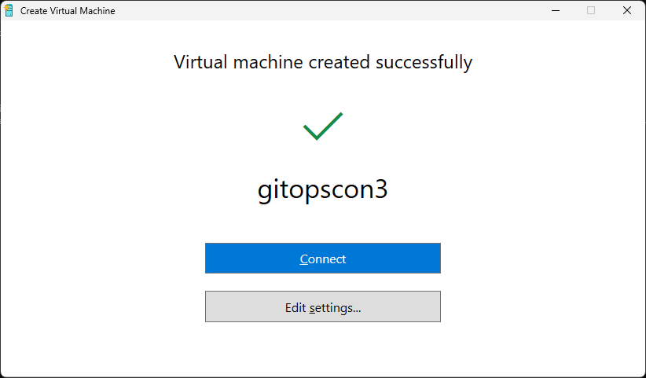
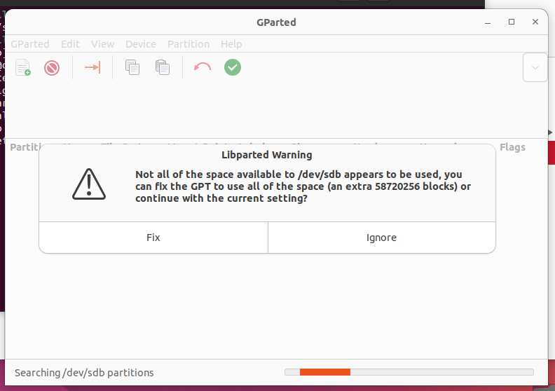

If you use quick create and select one of MS's templates, e.g.  Ubuntu 22.04 LTS, the resulting VM generally doesn't have enough space.

If you know this at create time here are steps you can use to increase the space to something useful.

1. Select quick create and in the quick create select the template you want. ( e.g. Ubuntu 22.04 LTS ) etc

   

2. After creation do _not_ connect.   Click edit settings 

   

3. Select the hard drive, note the virtual disk location, and then edit the hard drive 

   

4. In the edit wizard, select Expand and click next 

   

5. In the expand panel set the size to what you need and click finish

   

6. Click OK to dismiss the editor window 

7. Close the 'Create Virtual Machine' success window without connecting 

8. In Hyper-V Manager edit a linux vm other than the one you just created.  ( create a second one if you don't have one ).    Add the disk from above as SECOND disk

   

9. Boot up this 2nd VM and install gparted if it isn't already install 

10. Run gparted as root.   You should be presented with something like the screenshot below.  Select Fix

   

11. You should then be in the partition editor.    Select your disk from the drop down in the upper right hand corner.   ( /dev/sdb in this case )

   

12. Select the partition 1st partition ( /dev/sdb1  in this case ).   Click the resize tool 

   

13. Use the size slider to maximize the partition ( /dev/sdb1 in this case ) 

   

14. Click the apply button to apply the change 

   

15. Shutdown the 2nd VM 

16. Edit the 2nd VM, remove the disk you added previously

17. Boot up your new VM